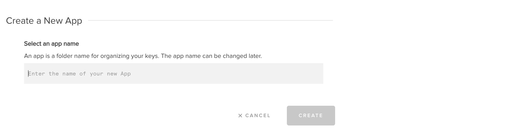
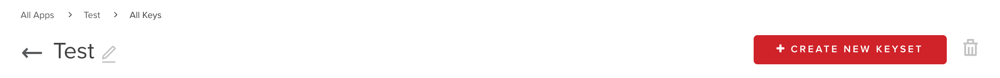
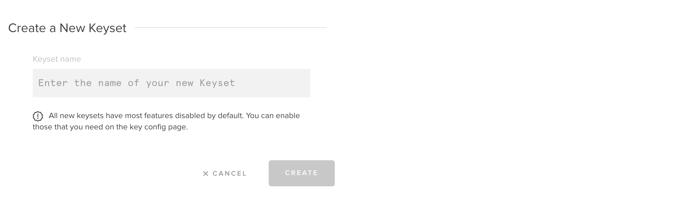

# PubNub DrChat

[](https://travis-ci.com/pubnub/kotlin-telemedicine-demo)

The DrChat app demonstrates how to build a feature-rich chat and team collaboration application
using [PubNub Chat](https://www.pubnub.com/docs/chat/quickstart). Learn how to manage users, join
chat rooms, and send messages with PubNub. Learn how to build advanced features like profanity
filtering, gifs, and link previews. You can download the project to run on your local machine, and
explore the code to see how we built it.


 |  |  |
--- | ---- | ---- |

The application demonstrates how to build a chat application using:

- PubNub
- Kotlin
- Jetpack Compose
- Coroutines

## Features

- 1:1 and group messaging,
- Fetching history of missed messages,
- Encrypted messages and database,
- Offline / online presence indicator,
- Typing indicator,
- Message receipts,
- File sharing.


## Requirements

- [Node.js](https://nodejs.org/en/)
- [PubNub Account](https://dashboard.pubnub.com/)
- [Android Studio Canary 8](https://developer.android.com/studio/preview)

## PubNub KeySet 

1. Navigate to the [PubNub Dashboard](https://dashboard.pubnub.com/) and login to your account. 

1. Select Apps and click on **Create New App** button. 


1. Provide your application name and click **Create**.


1. Select previously created App and create a new keyset.


1. Provide name of your keyset and click **Create**.


1. Enable **Presence**, **Storage & Playback**, **Files** feature and select the nearest region.


1. Save changes.

## Running the project

1. Clone the GitHub repository.

    ```bash
    git clone https://github.com/pubnub/kotlin-telemedicine-demo.git
    ```

1. Install the project to initialize data.

    ```bash
    cd kotlin-telemedicine-demo/setup
    npm install
    ```

1. Start the initialization. You'll be asked to enter your publish and subscribe keys from
   the [PubNub Dashboard](https://dashboard.pubnub.com/). You can also optional pass a cipher key 
   to enable message encryption.

    ```bash
    npm start
    ```

1. Start Android Studio and open a project. Please connect your Android phone or start an emulator
   and run application with default settings. To run application on both emulators you can use 
   **Select Multiple Devices**.
   
   
   If you need to create new emulator please check next section.


## Creating an emulator

For this project we suggest to create two **Pixel 2** devices with **Android Q** (API 29) system.

1. Open **AVD Manager** - select **Tools / AVD Manager**.
   
   
1. Click **Create Virtual Device…**, at the bottom of the AVD Manager dialog.
   

1. On **Hardware Profile** page please select **Phone** category, **Pixel 2** hardware, and then 
   click **Next**.
   

1. Select **Android Q** system image, then click **Next**. If you see **Download** next to the 
   system image, you need to click it to download the system image. You must be connected to the 
   internet to download it.
   

1. Provide your own device name in **AVD Name** field and click **Next**.
   

1. Repeat these steps for creating the second emulator.

For more information please follow [official guide to create and manage virtual devices](https://developer.android.com/studio/run/managing-avds).


## Changing properties

You can change publish, subscribe and cipher key manually. To do it, please edit a [gradle.properties](./gradle.properties) 
file.
