# PubNub Telemedicine App

[](https://travis-ci.com/pubnub/kotlin-telemedicine-demo)

The DrChat app demonstrates how to build a feature-rich telemedicine chat application using [PubNub Chat](https://www.pubnub.com/docs/chat/quickstart) and [PubNub Kotlin SDK](https://www.pubnub.com/docs/sdks/kotlin). Learn how to add private messaging for patients and doctors and group messaging for doctors to talk about cases. Learn how to build advanced features like online/offline presence indicators, typing indicators, read receipts, and file upload. You can download the project to run on your local machine, and explore the code to see how we built it.

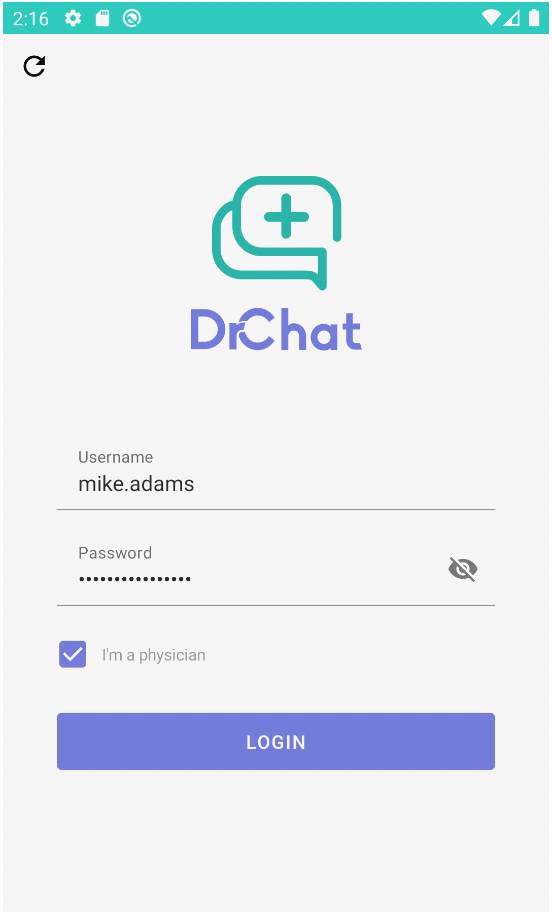 | 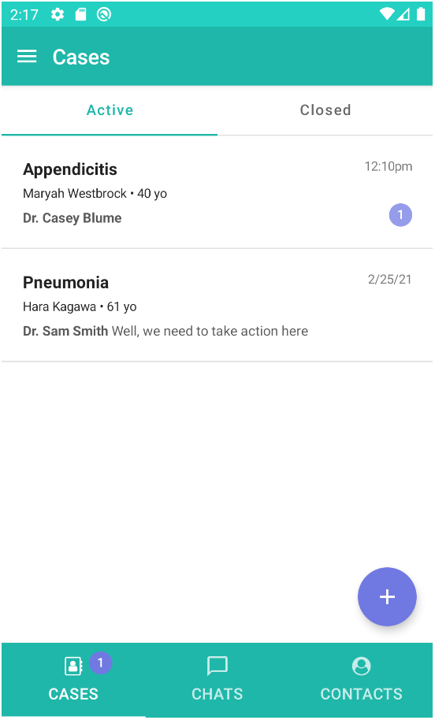 | 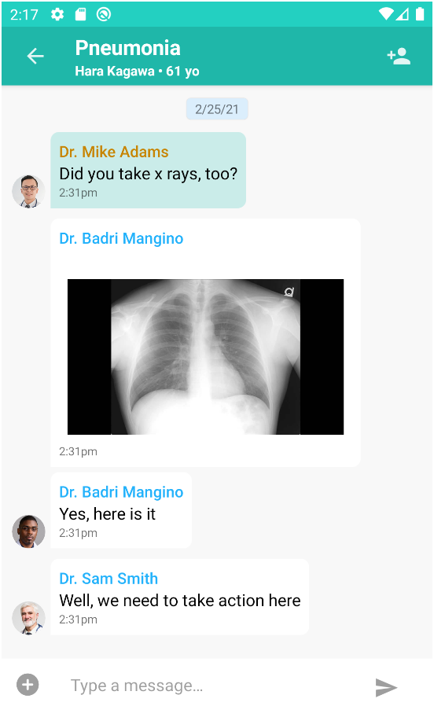 |
--- | ---- | ---- |

The application demonstrates how to build a chat application using:

- [PubNub](https://www.pubnub.com/)
- [Kotlin](https://kotlinlang.org/)
- [Jetpack Compose](https://developer.android.com/jetpack/compose)
- [Coroutines](https://kotlinlang.org/docs/coroutines-overview.html)

## Features

- 1:1 messaging between patients and doctors
- Group messaging between doctors via cases
- Fetching history of missed messages
- Encrypted messages for privacy
- Offline / online presence indicator
- Typing indicators to show activity 
- Message read receipts in 1:1 messaging
- File upload to share images and files

## Requirements

- [Node.js](https://nodejs.org/en/)
- [PubNub Account](https://dashboard.pubnub.com/)
- [PubNub Kotlin SDK 5.1.3+](https://www.pubnub.com/docs/sdks/kotlin)
- [Android Studio Canary 14](https://developer.android.com/studio/preview)

## PubNub KeySet 

1. Navigate to the [PubNub Dashboard](https://dashboard.pubnub.com/) and login to your account. 

1. Select an App or create a new App. 

1. Select a Keyset or create a new Keyset.

1. Enable **Presence**, **Storage & Playback**, **Files** features and select the nearest region.
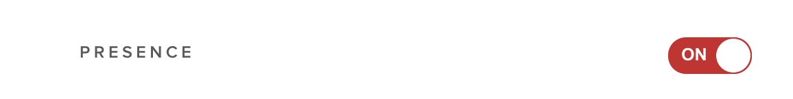

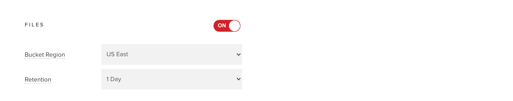

1. Save changes.


## Running the project

1. Clone the GitHub repository.

    ```bash
    git clone https://github.com/pubnub/kotlin-telemedicine-demo.git
    ```

1. Install the project to initialize data.

    ```bash
    cd kotlin-telemedicine-demo/setup
    npm install
    ```

1. Start the initialization. You'll be asked to enter your Publish Key and Subscribe Key from
   the [PubNub Dashboard](https://dashboard.pubnub.com/). You can also optional pass a cipher key 
   to enable message encryption.

    ```bash
    npm start
    ```

1. Start Android Studio and open a project. Wait until the gradle sync process is over.

1. Select the default configuration if it's available or create the new one.
   
   
   To add a new configuration click on **Add Configuration** / **+** and select **Android App**.
   
   
   Please enter your configuration name, select **Telemedicine.app** in Module and click **OK**.
   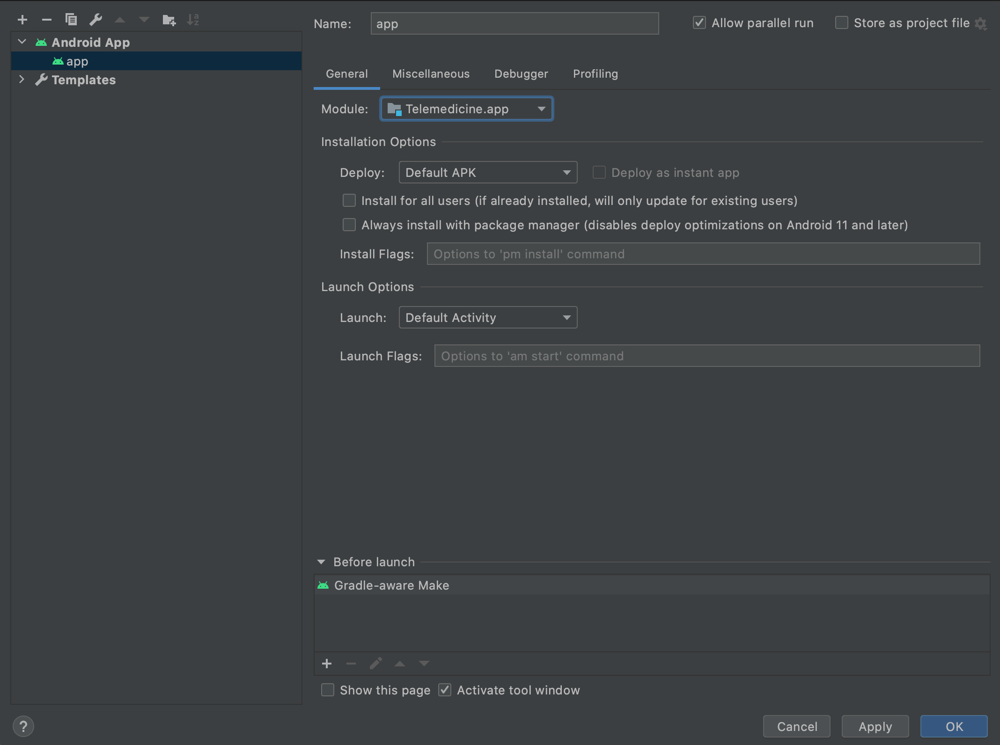
   
1. Please connect your Android phone or start an emulator and run application with selected 
   configuration. To run application on both emulators you can use 
   **Select Multiple Devices**.
   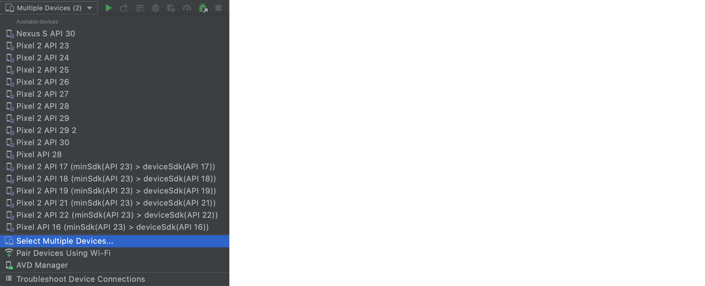
   
   If you need to create new emulator please check next section.
   


## Creating an emulator

For this project we suggest to create two **Pixel 2** devices with **Android Q** (API 29) system.

1. Open **AVD Manager** - select **Tools / AVD Manager**.
   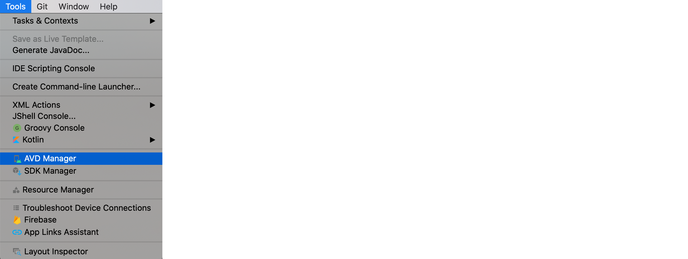
   
1. Click **Create Virtual Device…**, at the bottom of the AVD Manager dialog.
   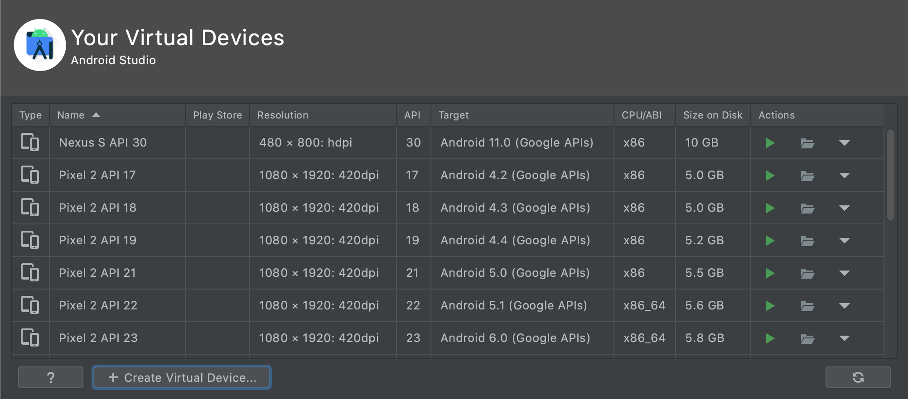

1. On **Hardware Profile** page please select **Phone** category, **Pixel 2** hardware, and then 
   click **Next**.
   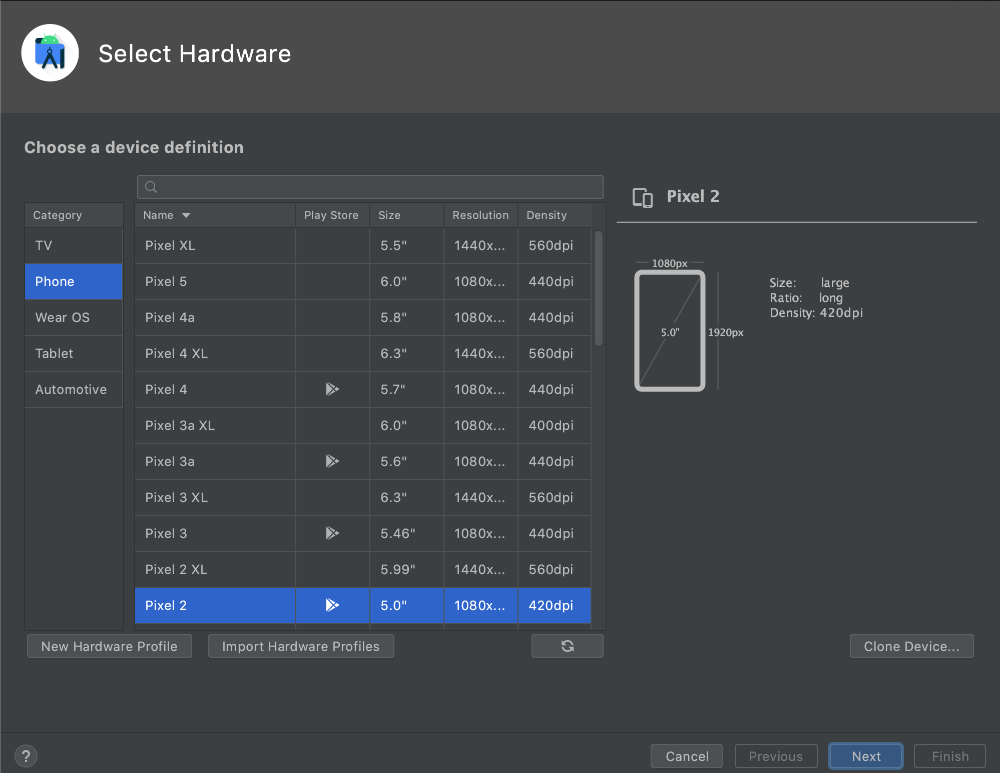

1. Select **Android Q** system image, then click **Next**. If you see **Download** next to the 
   system image, you need to click it to download the system image. You must be connected to the 
   internet to download it.
   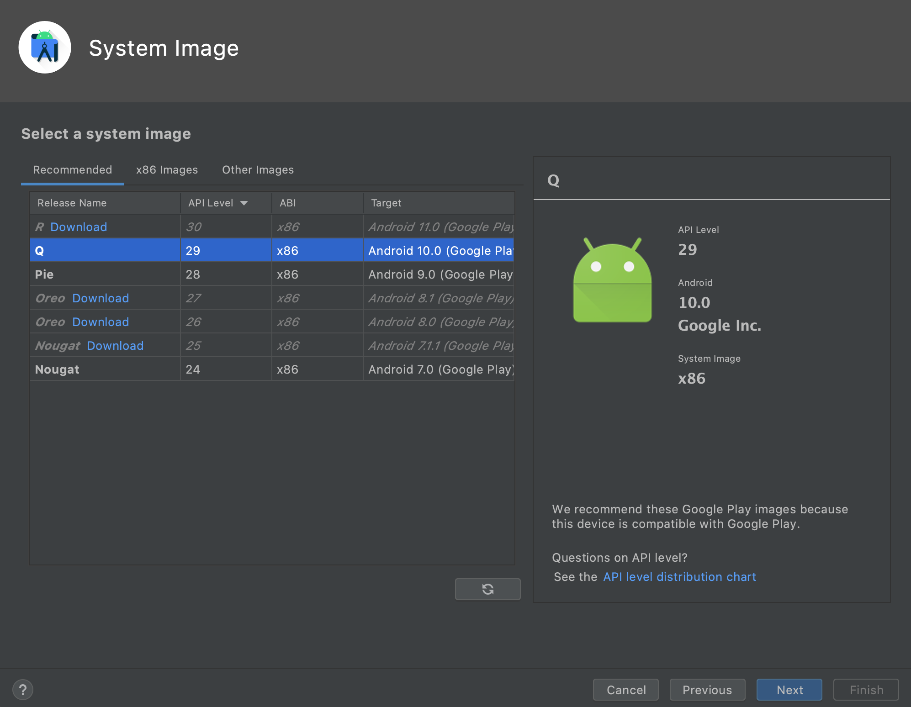

1. Provide your own device name in **AVD Name** field and click **Finish**.
   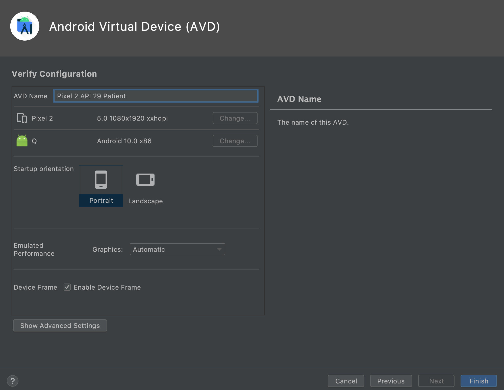

1. Repeat these steps for creating the second emulator.

For more information please follow [official guide to create and manage virtual devices](https://developer.android.com/studio/run/managing-avds).

## Changing properties

You can change publish, subscribe and cipher key manually. To do it, please edit a [gradle.properties](./gradle.properties) 
file.
